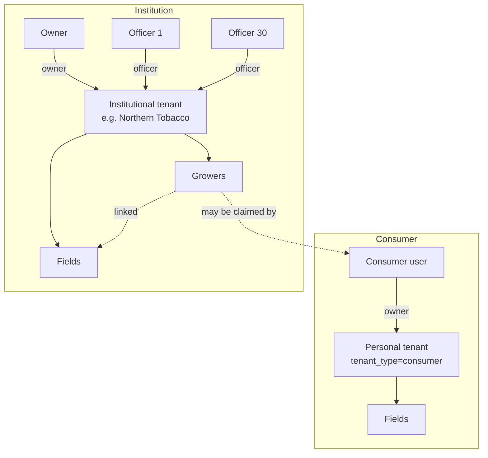

# Tenant Model — concepts

Workstream 3 moves field ownership from *user* to *tenant*. This document explains
the three new tables and how consumers and institutions map onto them.

## The tables

- **`tenants`** — an ownership boundary. `tenant_type` is `consumer` or
  `institutional` (institutional tenants also carry an `institutional_type`:
  buyer/lender/insurer/grower). Soft-deletable via `deleted_at`.
- **`tenant_members`** — maps `user_id` → `tenant_id` with a `member_role`
  (`owner` | `officer` | `viewer`). A user can belong to several tenants; their
  **primary** tenant is the earliest-joined one.
- **`growers`** — an institutional tenant's contracted growers. A grower may be
  `claimed_by_user_id` (a consumer farmer who also uses the app). Soft-deletable.
- **`fields`** gains `tenant_id` (the owning tenant) and optional `grower_id`
  (the grower this field belongs to). `fields.user_id` is **retained but
  deprecated** for migration safety.

## How roles map

- A **consumer** has a one-member tenant (they are the `owner`). Their fields'
  `tenant_id` points at it. Every `tenant_id`-scoped query therefore returns
  exactly what the old `user_id`-scoped query returned — **zero behaviour change**.
- An **institution** (e.g. Northern Tobacco) has one tenant with many members.
  All `owner`/`officer`/`viewer` members see the same fields and growers.
  `owner`/`officer` can write; `viewer` is read-only.
- An **admin** has no tenant; admins operate via the `X-Admin-Token` endpoints.

## Access rules (enforced in code)

`auth_roles.get_authenticated_user` resolves `tenant_id` / `tenant_ids` /
`member_role` onto the `AuthenticatedUser`. Then:

- `user_can_access_field(user, field_tenant_id)` — admin, or the field's tenant is
  one of the user's tenants.
- `user_can_modify_field(user, field_tenant_id)` — as above **and** member_role in
  (owner, officer). Viewers cannot write.

The field-state aggregator (`/field/{id}/state`) applies these: an absent field is
**404**, an out-of-scope field is **403** (never a 404 that leaks existence).

## Backfill guarantee

Migration 2 creates one `owner` tenant per non-admin profile; Migration 3
backfills every field's `tenant_id` from its owner. Verification (run by the
migrations and re-checked post-merge):

- `SELECT COUNT(*) FROM fields WHERE tenant_id IS NULL` → **0**
- consumer profile count == consumer tenant count
- no non-admin profile without a `tenant_members` row
